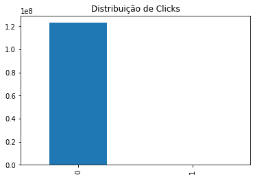
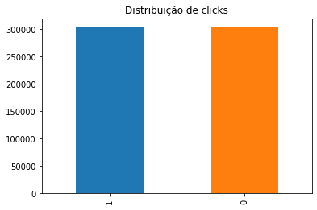
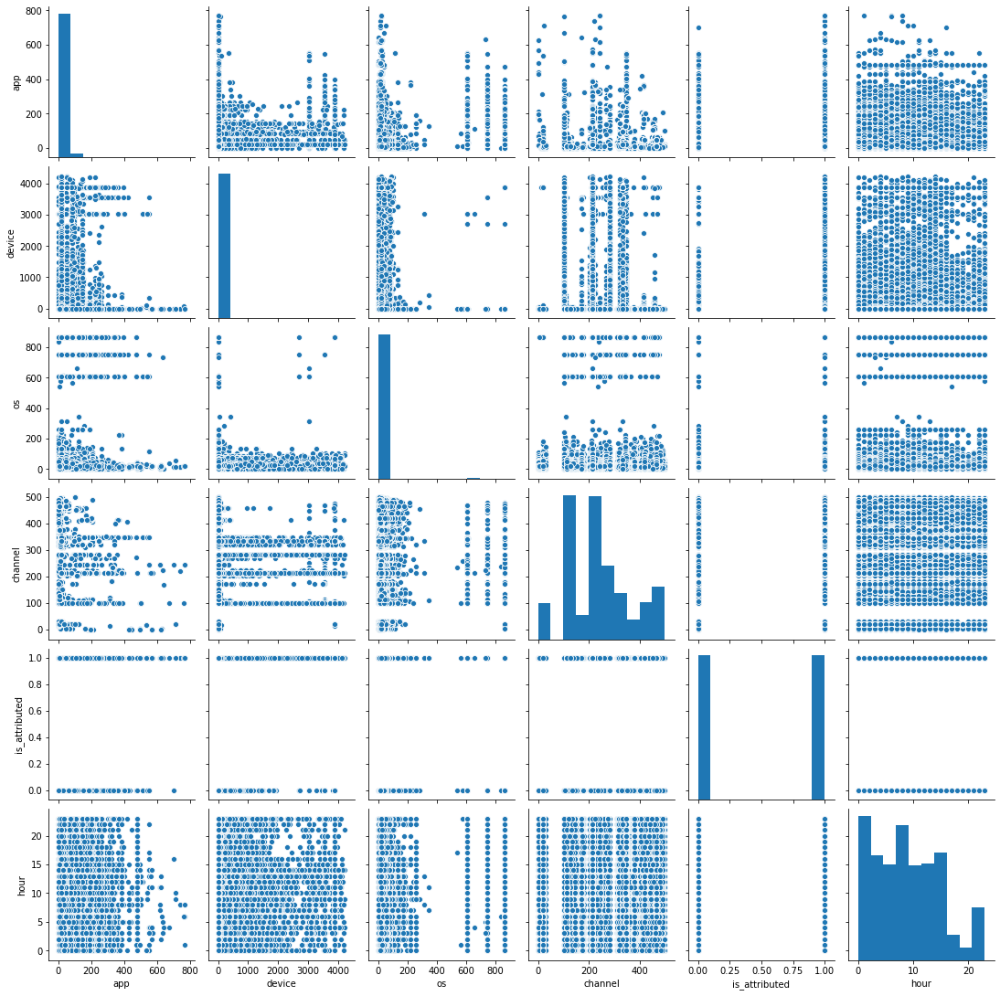
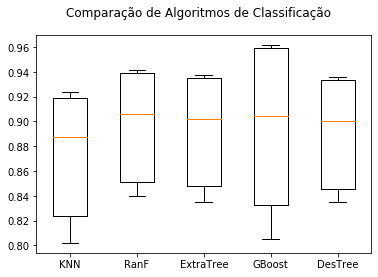

># Detecção de Fraudes no Tráfego de Cliques
># em Propagandas de Aplicações Mobile


>> ### Ralisson Araujo Ribeiro

>> #### Projeto do curso Big Data Analytics com R e Microsoft Azure Machine Learning da Data Science Academy

https://www.kaggle.com/c/talkingdata-adtracking-fraud-detection

## Análise primária do projeto

#### Introdução

Neste desafio promovido pelo Kaggle,  a Talking Data precisa reduzir o risco de fraude em cliques de anúncios que não geram download de aplicativos. Este cliques fraudulentos tem custo excessivo e precisam entender a jornada deste cliques.

A ideia do projeto é montar um modelo de ML capaz de prever se os ips e dispositivos que geram cliques fraudulentos e assim criar uma lista negra.

####  Histórico geral da análise nos primeiros testes

Devido ao tamanho do dataset de treino, com mais de 8gb e tendo apenas um pc com 12gb de Ram, foram testados dois processos abaixo antes deste jupiter notebook, aqui finalizado. veja a seguir o histórico:
        
1-) ETL completo do arquivo train.csv pelo pacote Pandas. Não foi possivel devido a limitação de memória. 
        
2-) ETL utilizando o pacote Dask (dask.org), que trabalha com particionamento de dados e possui diversas APIs do Panda, Numpy e Sklearn. Foi util no ETL e no processo de exploração dos dados, mas seria necessário reagrupar os paticionamentos para os processo de Machine Learning e durante a divisão dos dados em treino e teste. Neste ponto o pacote Dask não é pratico e em alguns casos a função não existia mais, mesmo a instrução estando disponivel na documentação oficial. 
        
3-) Por último e com sucesso foi utilizado a dica da cinetista de dados, Yulia (https://www.kaggle.com/yuliagm) que informou que uma das melhores maneiras de importar os dados, seria por uma coleta de amostra aleatória do dataset de treino. Após este processo realizado com sucesso, outro ponto fundamental foi a alteração da "mascara" antes da importação dos dados, afim de trazer o tamanho mínimo de cada coluna possivel.

Por último fizemos a equiparação entre as variáveis alvo dentro do processo de ETL, o que reduziu mais uma vez o tamanho do dataset, sendo possivel analisar e adotar um processo de ML estável em um máquina comum.

O processo de análise segue a metodologia de aprendizado supervisionado em um modelo de classificação binária.
        

#### Descritivo dos campos do dataset de treino

Cada linha dos dados de treinamento contém um registro de cliques, com os seguintes recursos.

ip: ip endereço de clique.

app: id de aplicativo para marketing.

device: identificação do tipo de dispositivo do telefone celular do usuário (por exemplo, iphone 6 plus, iphone 7, huawei mate 7, etc.)

os: id versão do sistema operacional do celular do usuário
channel: id do canal do editor de anúncios móveis

click_time: fuso de hora em hora (UTC)

attributed_time: se o usuário baixar o aplicativo para depois de clicar em um anúncio, esta é a hora do download do aplicativo

is_attributed: o alvo a ser previsto, indicando que o aplicativo foi baixado

https://www.kaggle.com/c/talkingdata-adtracking-fraud-detection/overview/description

## Pacotes, bibliotecas e configurações do sistema

 


```python
#pip install dask
#pip install joblib
```


```python
#pip install imbalanced-learn
```


```python
#ocultando mensagens de warning
import warnings
warnings.filterwarnings("ignore")
```


```python
#importanto os principais pacotes
import pandas as pd
import numpy as np

import gc
import os

import dask
```

#### Se necessário, poderemos ativar a função de trabalho distribuido do pacote Dask


```python
#Se desejar, o analista poderá ativar o código abaixo e abrir uma tela localhost para visualizar os trabalhos em background.
from dask.distributed import Client, progress
client = Client(processes=False, threads_per_worker=1,
                n_workers=3, memory_limit='8GB')
client
```


<table style="border: 2px solid white;">
<tr>
<td style="vertical-align: top; border: 0px solid white">
<h3 style="text-align: left;">Client</h3>
<ul style="text-align: left; list-style: none; margin: 0; padding: 0;">
  <li><b>Scheduler: </b>inproc://192.168.1.73/20476/1</li>
  <li><b>Dashboard: </b><a href='http://192.168.1.73:8787/status' target='_blank'>http://192.168.1.73:8787/status</a>
</ul>
</td>
<td style="vertical-align: top; border: 0px solid white">
<h3 style="text-align: left;">Cluster</h3>
<ul style="text-align: left; list-style:none; margin: 0; padding: 0;">
  <li><b>Workers: </b>3</li>
  <li><b>Cores: </b>3</li>
  <li><b>Memory: </b>24.00 GB</li>
</ul>
</td>
</tr>
</table>


```python
#limpando a memoria de residuos
gc.collect()
```


    20


## Extração, tratamento e limpeza de dados

 

Neste trabalho carregaremos apenas uma amostra do dataset train.csv devido ao seu extenso tamanho e as limitações citadas acima. Porém a amostra terá 66% dos dados originais e a extração será aleatória sem reposição.


```python
#Nomeando as colunas do dataset
#Definindo a menor "máscara" para a caputura dos dados, desta forma o dataset será menor que o padrão
#de importação da função read_csv do Pandas

dtypes = {
    
    'ip': 'uint32',
    'app': 'uint16',
    'device': 'uint16',
    'os': 'uint16',
    'channel': 'uint16',
    'is_attributed': 'uint8',
    
}
```


```python
# Usaremos 2/3 do dataset train.csv para a analise e criação do modelo de machine learning.

lines = 184903891
divisor = 1.5
amostra = int(lines / divisor)

skiplines = np.random.choice(np.arange(1, lines), size=lines-1-(amostra), replace=False)
skiplines= np.sort(skiplines)

#import joblib
#with joblib.parallel_backend('dask'):
%time train = pd.read_csv('./data/train.csv', skiprows=skiplines, dtype=dtypes, parse_dates=['click_time', 'attributed_time'])

```

    Wall time: 2min 27s
    


```python
# Limpeza de memória, etapa necessária para a continuação do processo se você tiver uma máquina com menos
#de 12gb de mmória Ram
del skiplines
gc.collect()
```


```python
train.info()
```

    <class 'pandas.core.frame.DataFrame'>
    RangeIndex: 123269260 entries, 0 to 123269259
    Data columns (total 8 columns):
     #   Column           Dtype         
    ---  ------           -----         
     0   ip               uint32        
     1   app              uint16        
     2   device           uint16        
     3   os               uint16        
     4   channel          uint16        
     5   click_time       datetime64[ns]
     6   attributed_time  datetime64[ns]
     7   is_attributed    uint8         
    dtypes: datetime64[ns](2), uint16(4), uint32(1), uint8(1)
    memory usage: 3.3 GB
    

Perceba que a memória usada é de 3.3gb, onde já tivemos nossa primeira redução.

#### Eliminando colunas desnecessárias

Vamos eliminar a coluna IP e Attributed_time. A primeira seria como um ID do computador e a outra só existe quando a variável alvo é igual a 1, então essa é uma coluna desnecessária.


```python
train = train.drop(columns=[ 'ip', 'attributed_time'], inplace=False)
```


```python
train.info()
```

    <class 'pandas.core.frame.DataFrame'>
    RangeIndex: 123269260 entries, 0 to 123269259
    Data columns (total 6 columns):
     #   Column         Dtype         
    ---  ------         -----         
     0   app            uint16        
     1   device         uint16        
     2   os             uint16        
     3   channel        uint16        
     4   click_time     datetime64[ns]
     5   is_attributed  uint8         
    dtypes: datetime64[ns](1), uint16(4), uint8(1)
    memory usage: 2.0 GB
    

2º redução de tamanho de memória utilizada

### Análise e balanceamento do Target

Na etapa abaixo, iremos equipara os dados da feature alvo e verificar o balanceamento entre cliques positivos, que geraram downloads de aplicativos(click 1) e o que são fraudulentos(click 0)


```python
target_count = train['is_attributed'].value_counts()
print('Click 0:', target_count[0])
print('Click 1:', target_count[1])
print('Proporção:', (round(target_count[1] / target_count[0], 6)*100), '%')
target_count.plot(kind='bar', title='Distribuição de Clicks',color = ['#1F77B4', '#FF7F0E']);
```

    Click 0: 122964624
    Click 1: 304636
    Proporção: 0.2477 %
    





Nosso modelo tem apenas uma taxa de 0,24% de clicks que geraram downloads sobre o total de clicks. Para a fase de modelagem preditiva, isso terá que ser balanceado antes da criação do modelo. Devido a grande diferença entre clicks que geraram downloads e que não geraram, vamos equalizar esse dataset antes mesmo de continuarmos para fase de análise exploratória.

O método aplicado será o Undersampling, onde reduziremos a maior variável Click 0, para o mesmo patamar da variável Click 1. Em um processo com dataset menor, talvez a melhor abordagem fosse o método Oversampling, em que a menor variavel alvo é "aumentada", em termos de quantidade de observações, até se equiparar ao maior target do conjunto.


```python
# contagem das classes 0 e 1 da variavel target
clicks_0, clicks_1 = train['is_attributed'].value_counts()

# Divisão de Classes
df_class_0 = train[train['is_attributed'] == 0]
df_class_1 = train[train['is_attributed'] == 1]
df_class_0_under = df_class_0.sample(clicks_1)
train2 = pd.concat([df_class_0_under, df_class_1], axis=0)

print('Random under-sampling:')
print(train2['is_attributed'].value_counts())
train2['is_attributed'].value_counts().plot(kind='bar', title='Distribuição de clicks',color = ['#1F77B4', '#FF7F0E']);
```

    Random under-sampling:
    1    304636
    0    304636
    Name: is_attributed, dtype: int64
    





```python
#limpeza de memória

del clicks_0
del clicks_1
del df_class_0
del df_class_1
del df_class_0_under
del train

gc.collect()
```


    5020


```python
train2.info()
```

    <class 'pandas.core.frame.DataFrame'>
    Int64Index: 609272 entries, 19511275 to 123254901
    Data columns (total 6 columns):
     #   Column         Non-Null Count   Dtype         
    ---  ------         --------------   -----         
     0   app            609272 non-null  uint16        
     1   device         609272 non-null  uint16        
     2   os             609272 non-null  uint16        
     3   channel        609272 non-null  uint16        
     4   click_time     609272 non-null  datetime64[ns]
     5   is_attributed  609272 non-null  uint8         
    dtypes: datetime64[ns](1), uint16(4), uint8(1)
    memory usage: 14.5 MB
    

observe que esta foi a 3º redução de tamanho de memória.

#### Uma pausa para reflexão

Este processo de redução de dados tem seu custo. Vamos perceber que as etapas de análise explorátoria ficaram prejudicadas e inclusive algumas foram excluídas deste notebook, como por exemplo gráficos em busca de outliers.

E por que não a análise exploratória ficou prejudicada?

Fizemos 2 processos que impactaram: 1-) Coleta do dataset original através de amostra, 2-) Processo de balancemento pelo método Undersampling. isso causou uma redução de 184milhões de registros para 600mil, aproximadamente. Qualquer análise exploratória já não estaria falando do dataset original.


#### Verificando se existem valores Nulos


```python
train2.count().isna()
```


    app              False
    device           False
    os               False
    channel          False
    click_time       False
    is_attributed    False
    dtype: bool


```python
train2.count().isnull()
```


    app              False
    device           False
    os               False
    channel          False
    click_time       False
    is_attributed    False
    dtype: bool


```python
#limpeza de memoria
gc.collect()
```


    214


Vamos selecionar apenas as horas da coluna Click_time, pois o dataset é de apenas 3 dias e depois
vamos excluir esta coluna.


```python
train2["hour"] = train2["click_time"].dt.hour
train2.head()
```


<div>
<style scoped>
    .dataframe tbody tr th:only-of-type {
        vertical-align: middle;
    }

    .dataframe tbody tr th {
        vertical-align: top;
    }

    .dataframe thead th {
        text-align: right;
    }
</style>
<table border="1" class="dataframe">
  <thead>
    <tr style="text-align: right;">
      <th></th>
      <th>app</th>
      <th>device</th>
      <th>os</th>
      <th>channel</th>
      <th>click_time</th>
      <th>is_attributed</th>
      <th>hour</th>
    </tr>
  </thead>
  <tbody>
    <tr>
      <th>19511275</th>
      <td>12</td>
      <td>1</td>
      <td>19</td>
      <td>245</td>
      <td>2017-11-07 05:57:14</td>
      <td>0</td>
      <td>5</td>
    </tr>
    <tr>
      <th>59420150</th>
      <td>14</td>
      <td>1</td>
      <td>19</td>
      <td>463</td>
      <td>2017-11-08 06:03:15</td>
      <td>0</td>
      <td>6</td>
    </tr>
    <tr>
      <th>25912393</th>
      <td>12</td>
      <td>1</td>
      <td>10</td>
      <td>265</td>
      <td>2017-11-07 09:16:47</td>
      <td>0</td>
      <td>9</td>
    </tr>
    <tr>
      <th>91814906</th>
      <td>21</td>
      <td>1</td>
      <td>3</td>
      <td>128</td>
      <td>2017-11-09 01:49:06</td>
      <td>0</td>
      <td>1</td>
    </tr>
    <tr>
      <th>102845273</th>
      <td>18</td>
      <td>1</td>
      <td>13</td>
      <td>379</td>
      <td>2017-11-09 06:30:58</td>
      <td>0</td>
      <td>6</td>
    </tr>
  </tbody>
</table>
</div>


```python
# Vamos deletar a coluna de data e hora 
train2 = train2.drop(columns=[ 'click_time'], inplace=False)
```


```python
train2.info()
```

    <class 'pandas.core.frame.DataFrame'>
    Int64Index: 609272 entries, 19511275 to 123254901
    Data columns (total 6 columns):
     #   Column         Non-Null Count   Dtype 
    ---  ------         --------------   ----- 
     0   app            609272 non-null  uint16
     1   device         609272 non-null  uint16
     2   os             609272 non-null  uint16
     3   channel        609272 non-null  uint16
     4   is_attributed  609272 non-null  uint8 
     5   hour           609272 non-null  int64 
    dtypes: int64(1), uint16(4), uint8(1)
    memory usage: 14.5 MB
    


```python
train2['hour'] = train2['hour'].astype('uint16')
train2.info()
```

    <class 'pandas.core.frame.DataFrame'>
    Int64Index: 609272 entries, 19511275 to 123254901
    Data columns (total 6 columns):
     #   Column         Non-Null Count   Dtype 
    ---  ------         --------------   ----- 
     0   app            609272 non-null  uint16
     1   device         609272 non-null  uint16
     2   os             609272 non-null  uint16
     3   channel        609272 non-null  uint16
     4   is_attributed  609272 non-null  uint8 
     5   hour           609272 non-null  uint16
    dtypes: uint16(5), uint8(1)
    memory usage: 11.0 MB
    


```python
#Mais uma limpeza de memória
gc.collect()
```


    2112


## Visualização e análise exploratória dos dados de treino

 

### Análise por correlação

Vamos agora criar uma matrix de correlação entre as features


```python
correl = train2.corr()
print(correl)
```

                        app    device        os   channel  is_attributed      hour
    app            1.000000  0.088011  0.111825 -0.131386       0.328293 -0.004296
    device         0.088011  1.000000  0.511100 -0.010380       0.021740  0.018352
    os             0.111825  0.511100  1.000000 -0.017237       0.016471  0.011259
    channel       -0.131386 -0.010380 -0.017237  1.000000      -0.249840  0.058939
    is_attributed  0.328293  0.021740  0.016471 -0.249840       1.000000 -0.058911
    hour          -0.004296  0.018352  0.011259  0.058939      -0.058911  1.000000
    

Observe que OS e Device tem uma correlação de 0.52, já indica alguma correlação, porém nenhuma das duas isoladas faz correlação com a variável de classificação e por ser um dataset de poucas features, esta colineariadade será mantida.

### Visualizações


```python
import seaborn as sns
```


```python
# Pairplot
sns.pairplot(train2)
```


    <seaborn.axisgrid.PairGrid at 0x200384c2888>





```python
#limpeza de memória residual
gc.collect()
```


    125


## Modelo de Machine Learning

 


```python
train2.columns
```


    Index(['app', 'device', 'os', 'channel', 'is_attributed', 'hour'], dtype='object')


```python
# Vamos separar as colunas em Features e Target
features = train2[
    [
        
    'app', 'os', 'channel', 'hour'
    ]
    
]
target = train2['is_attributed']  
```


```python
gc.collect()
```


    2303


```python
#Divisão do dataset em treino e teste

from sklearn.model_selection import train_test_split

X = features
y = target


X_train, X_test, y_train, y_test = train_test_split(X, y, test_size=0.33, random_state=133)
```
Vamos testar qual modelo apresenta a melhor acurácia para os datos de treino

```python
# Importando os módulos necessários

import matplotlib.pyplot as plt
from sklearn.model_selection import KFold
from sklearn.model_selection import cross_val_score
from sklearn.linear_model import LogisticRegression
from sklearn.tree import DecisionTreeClassifier
from sklearn.neighbors import KNeighborsClassifier
from sklearn.discriminant_analysis import LinearDiscriminantAnalysis
from sklearn.ensemble import RandomForestClassifier
from sklearn.naive_bayes import GaussianNB
from sklearn.svm import SVC
from sklearn.linear_model import SGDClassifier
from sklearn.ensemble import ExtraTreesClassifier
from sklearn.ensemble import GradientBoostingClassifier
from sklearn.ensemble import AdaBoostClassifier
from sklearn.neural_network import MLPClassifier


# Carregando features e Target
X = features
Y = target

# Definindo os valores para o número de folds
num_folds = 10
seed = 7

# Preparando uma lista de modelos que serão analisados.


modelos = []

#modelos.append(('LDA', LinearDiscriminantAnalysis()))
#modelos.append(('NB', GaussianNB()))
modelos.append(('KNN', KNeighborsClassifier()))
modelos.append(('RanF', RandomForestClassifier(bootstrap=False, max_depth=30, 
                                               max_features='log2', min_samples_split=10, 
                                               min_weight_fraction_leaf=0, n_estimators=50, warm_start=True)))

#modelos.append(('SGD', SGDClassifier()))
modelos.append(('ExtraTree', ExtraTreesClassifier()))
modelos.append(('GBoost', GradientBoostingClassifier()))
#modelos.append(('AdaBoost', AdaBoostClassifier()))
modelos.append(('DesTree', DecisionTreeClassifier()))
#modelos.append(('MLP', MLPClassifier(hidden_layer_sizes=(50,50,50), activation='logistic', solver='adam', alpha=0.0001)))
#modelos.append(('SVM', SVC()))

# Avaliando cada modelo em um loop
resultados = []
nomes = []


for nome, modelo in modelos:
    kfold = KFold(n_splits = num_folds, random_state = seed)
    cv_results = cross_val_score(modelo, X, Y, cv = kfold, scoring = 'accuracy')
    resultados.append(cv_results)
    nomes.append(nome)
    msg = "%s: %f (%f)" % (nome, cv_results.mean(), cv_results.std())
    print(msg)


# Boxplot para comparar os algoritmos
fig = plt.figure()
fig.suptitle('Comparação de Algoritmos de Classificação')
ax = fig.add_subplot(111)
plt.boxplot(resultados)
ax.set_xticklabels(nomes)
plt.show()
```

    KNN: 0.871579 (0.049772)
    RanF: 0.896384 (0.044041)
    ExtraTree: 0.892019 (0.044328)
    GBoost: 0.893353 (0.067487)
    DesTree: 0.890957 (0.044139)
    





O modelo de machine learning escolhido foi Random Forest do pacote Sklearn com acurácia média de 90% e desvio padrão de 4%.
 
E porque desta escolha e não o Gradient Boosting?

R-) Pelo tempo de resposta do modelo e do desvio padrão.
 

### Aplicação e Avaliação Métrica do Modelo de Machine Learning com o Random Forest


```python
# Avaliação do modelo usando o 

from pandas import read_csv
from sklearn.model_selection import KFold
from sklearn.model_selection import cross_val_score
from sklearn.metrics import mean_squared_error
from sklearn.metrics import mean_absolute_error
from sklearn.metrics import r2_score
from sklearn.model_selection import cross_val_score
from sklearn.metrics import confusion_matrix
from sklearn.metrics import classification_report


# Separando as features e target
X = features
Y = target

# Divide os dados em treino e teste
X_train, X_test, Y_train, Y_test = train_test_split(X, Y, test_size = 0.33, random_state = 5)

# Criando o modelo
Model = RandomForestClassifier(bootstrap=False, max_depth=30, max_features='log2', min_samples_split=10,
                               min_weight_fraction_leaf=0, n_estimators=50, warm_start=True)


# Definindo os valores para o número de folds
num_folds = 10
seed = 7
    
# Separando os dados em folds
kfold = KFold(num_folds, True, random_state = seed)    
    

# Treinando o modelo
Model.fit(X_train, Y_train)


# Previsão do modelo

Predict = Model.predict(X_test)


# Acurácia final e ROC
resultadoAC = cross_val_score(Model, X, Y, cv = kfold, scoring = 'accuracy')
resultadoROC = cross_val_score(Model, X, Y, cv = kfold, scoring = 'roc_auc')

print("ROC foi de: %.3f" % (resultadoROC.mean() * 100))
print("A Acurácia foi de: %.3f%%" % (resultadoAC.mean() * 100.0))


report = classification_report(Y_test, Predict)

# Imprimindo o relatório
print(report)
```

    ROC foi de: 95.975
    A Acurácia foi de: 91.509%
                  precision    recall  f1-score   support
    
               0       0.89      0.95      0.92    100378
               1       0.95      0.88      0.91    100682
    
        accuracy                           0.92    201060
       macro avg       0.92      0.92      0.92    201060
    weighted avg       0.92      0.92      0.92    201060
    
    

Conseguimos finalizar o modelo preditivo com uma acurácia de 91,5% aprox. Podemos considerar que este é um bom resultado e agora é so colocar em prática. Vamos salvar o modelo.

### Modelo Pronto!


```python
# Salvando o modelo Preditivo
import pickle

arquivo_salvo = 'model/Model_TalkingData.sav'
pickle.dump(Model, open(arquivo, 'wb'))
print("Seu modelo esta salvo!")

```

    Seu modelo esta salvo!
    


```python
#Para importar o modelo uso os comandos abaixo
# Carregando o arquivo

Model_TalkingData = pickle.load(open(arquivo_salvo, 'rb'))
modelo_prod = Model_TalkingData.score(X_test, Y_test)
print("Modelo carregado com sucesso!")
```

    Modelo carregado com sucesso!
    

 

# FIM 
